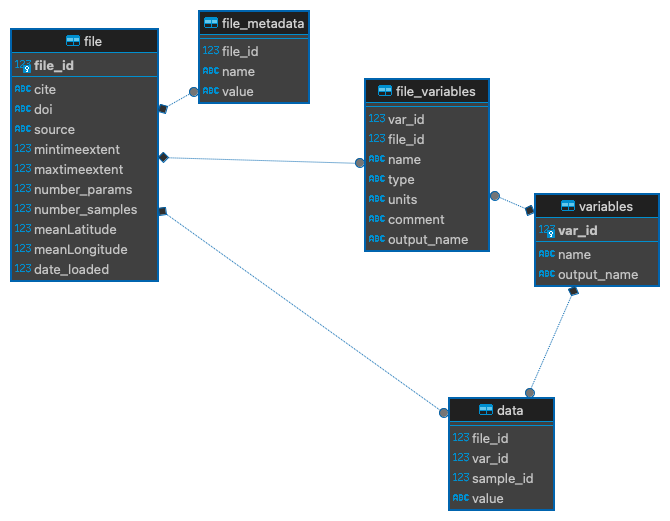

Python code to load data from data sources (Pangaea) into a common database

map from Mouw 2016 (doi.org/10.1594/PANGAEA.855594) 

![Mouw Map][maps/map-mouw.png]

database scructure

load the urls into the database

    python load_pangaea_file.py pangaea-test-urls.txt

load the urls into the data table

    python load_pangaea_data.py

using the pivotvtab extension to sqlite

    create virtual table ct using pivot_vtab (
            -- rows
            (select distinct (file_id * 1000000) + sample_id AS file_sample_id from data),
            --columns
            (select var_id, concat(var_id, ' ', variables.name) from variables) ,
            -- data
            (select value from data where (file_id * 1000000) + sample_id  = ?1 and var_id = ?2)
    );

now the data can be selected

    select * from ct;

